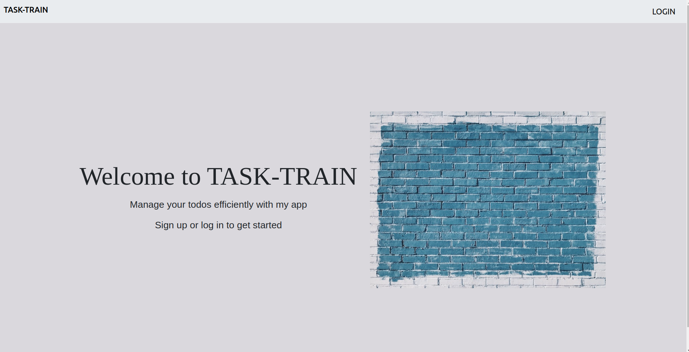
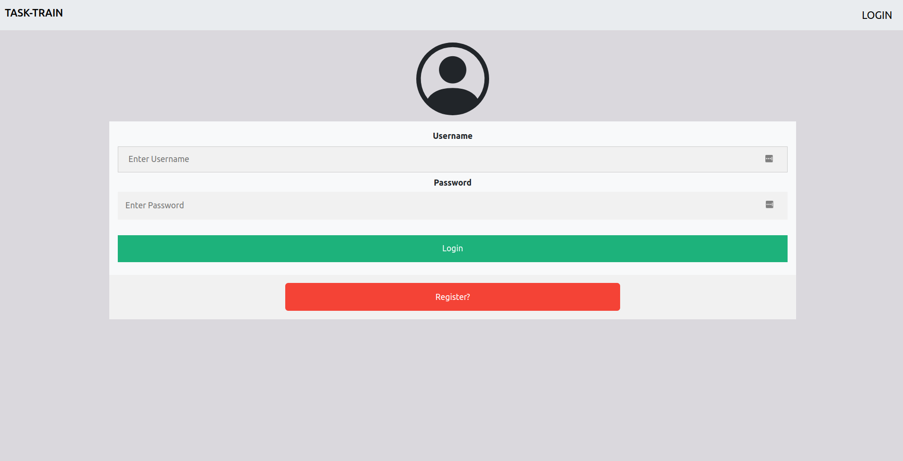
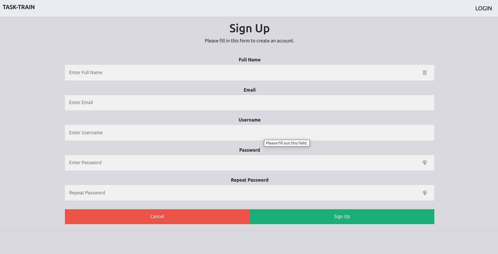
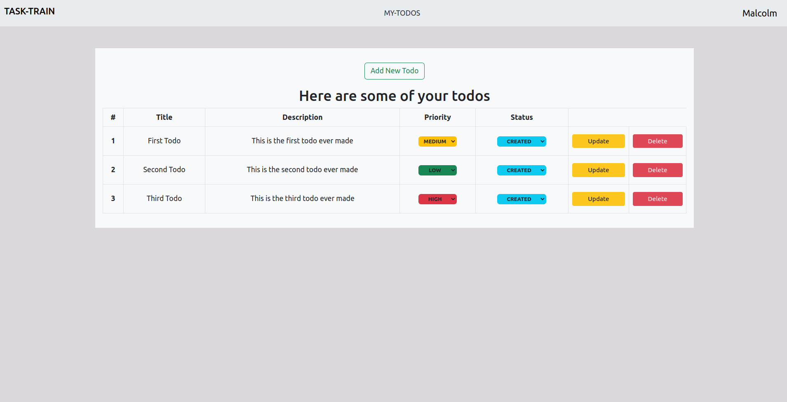
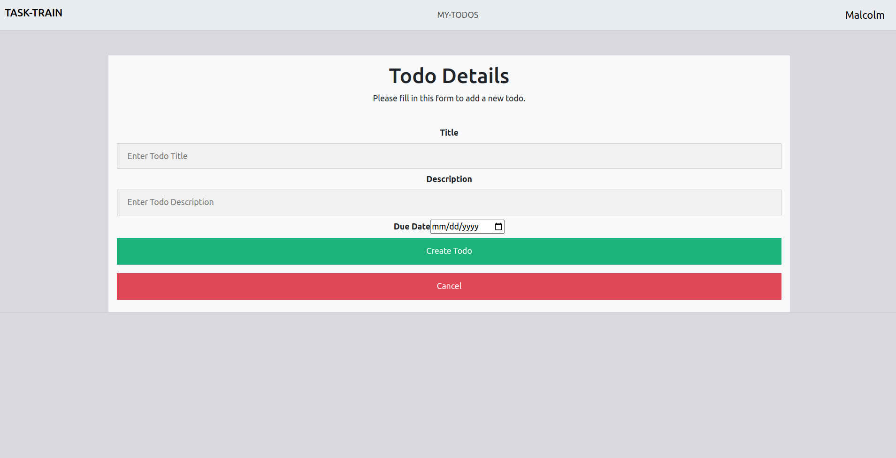

# TASK-TRAIN

## Description
This project is a web app named **Task-Train**,a simple todo app that allows a users to create new todos and manage them as they see fit.
This repository is the frontend side of the application. The backend being a Ruby built API that uses Rails.
More information on the backend can be found in the following link: [Task-Train Back-end](https://github.com/Malcolm-G/task-train-backend). 

## Technologies Used
This project was bootstrapped with [Vite](https://vitejs.dev/).
Notable technologies used in this project include:
- [React](https://reactjs.org/)

The application also gets and stores data using an API built with Rails. 
<!-- The API is made accessible by hosting it using [Render](https://render.com/), a hosting platform. The main API link is as below:

        https://malcolm-p3-project-app.onrender.com/ -->
        

## Project Setup
### Installation of application
In order for you to use the content on this repo ensure you have the following:

- A computer that runs on either of the following: (Windows 7+, Linux, Mac OS)
- NPM
- 
Installation of the application is not necessary but if one wishes to, the steps are described below.
The installation steps are described for a linux machine.\
To use this repo on your machine requires some simple steps

#### Alternative One (Cloning directly from my repository)
- Open a terminal / command line interface on your computer

- Clone the repo into your folder of choice by using the following:

        git clone https://github.com/Malcolm-G/task-train-frontend.git

- Change directory to the repo folder:

        cd task-train-frontend
- (Optional) Open it in Visual Studio Code

  
        code .
- (Alternate Option) Open it in any editor of your choice.

- Install the relevant dependencies by running the command:

        npm install

#### Alternative Two (Forking to your own repository)
- On the top right corner of this page there is a button labelled **Fork**.

- Click on that button to fork the repo to your own account.

- Take on the process in Alternative One above.

- Remember to use your username when cloning.

        git clone https://github.com/your-username-here/task-train-frontend.git

### Running the application
If you wish to run application from cloned repository:

- In the terminal run the command: `npm run dev`

If you wish to access the application without cloning it to your computer,simply follow this simple step:
- Access the website by going to the following link:
   
                https://task-train-frontend.vercel.app/

---

## Using The Application
On first entering the application, you'll be met with the below landing page:

Next you need to sign up or login so as to use the application.Click the button labelled **LOGIN** at the top right corner.

You'll then be met with the login screen as shown below:

So as to test the app, you may use a dummy account by logging in with the credentials below:

            Username: Malcolm
            Password: 123

If you wish to create your own account, click the button **'Register?'** and you shall be met with the page below:

After logging in, you shall be returned to the home page:

You now have the option **'MY-TODOS'** on the navbar. Click the option and you'll view your todos. Below are the todos of the dummy account that was mentioned beforehand:

You may click the **'Add Todo'** button to create a new todo. It shall direct you to a form:

The update button shall direct you to a form that is prepopulated with the data that is currently tied to the todo. You may change any field to update the todo.

## Authors
This project was contributed to by:
- [Malcolm Githuka](https://github.com/Malcolm-G-Moringa)
## License
The project is under GNU GENERAL PUBLIC LICENSE Version 3

